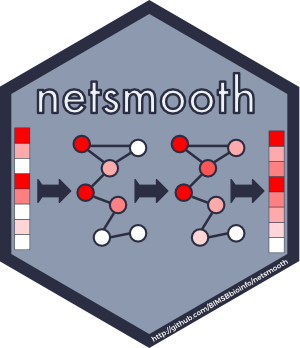

	

---------

 

**netSmooth: A Network smoothing based method for single cell RNA-seq**
-----
netSmooth is an R package for network smoothing of single cell RNA sequencing data. Using gene interaction networks such as protein-
protein interactions as priors for gene co-expression, netsmooth improves cell type identification from noisy, sparse scRNA-seq data.
The smoothing method is suitable for other gene-based omics data sets such as proteomics, copy-number variation, etc.

The algorithm uses a network-diffusion based approach which takes in a network (such as PPI network) and gene-expression matrix. The gene 
expression values in the matrix are smoothed using the interaction information in the network. The network-smoothing parameter is 
optimized using a robust clustering approach.

### Installation

	library(devtools)
	install_github("BIMSBbioinfo/netSmooth")

### Usage
For detailed usage information see  [the vignette](http://htmlpreview.github.io/?https://github.com/BIMSBbioinfo/netSmooth/blob/master/vignettes/netSmoothIntro.html). In addition,
R package has full function documentation with examples. 

### License

netSmooth is available under a GPLv3 license.

### Contributing

Fork and send a pull request. Or just e-mail us.

-------------------------
@jonathanronen, BIMSBbioinfo, 2017

