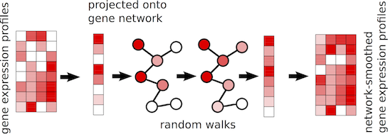

```{r setup, include=FALSE}

```


# Introduction
_netSmooth_ implements a network-smoothing framework to smooth 
single-cell gene expression data as well as other omics datasets. 
The algorithm is a graph based diffusion process on networks. The 
intuition behind the algorithm is that gene networks encoding 
coexpression patterns may be used to smooth scRNA-seq expression 
data, since the gene expression values of connected nodes in the 
network will be predictive of eachother. Protein-protein interaction
(PPI) networks and coexpression networks are among the networks that
could be used for such procedure. 


More precisely, _netSmooth_ works as follows. First, the gene 
expression values or other quantitative values per gene from each 
sample is projected on to the provided network. Then, the diffusion 
process is used to smooth the expression values of adjacent 
genes in the graph, so that a genes expression value 
represent an estimate of expression levels based the gene it self, 
as well as the expression 
values of the neighbors in the graph. The rate at which expression 
values of genes diffuse to their neighbors is degree-normalized, so 
that genes with many edges will affect their neighbors less than 
genes with more specific interactions. The implementation has one 
free parameter, `alpha`, which controls if the diffusion will be 
local or will reach further in the graph. Higher the value, the 
further the difussion will reach. The _netSmooth_ package 
implements strategies to optimize the value of `alpha`.

```{r netsum,echo=FALSE,fig.cap="Network-smoothing concept"}
# All defaults

```

In summary, _netSmooth_ enables users to smooth quantitative values 
associated with genes using a gene interaction network such as a 
protein-protein interaction network. The following sections of this 
vignette demonstrate functionality of `netSmooth` package.


# Smoothing single-cell gene expression data with netSmooth() function
The workhorse of the _netSmooth_ package is the `netSmooth()` 
function. This function takes at least two arguments, 
a network and genes-by-samples matrix as input, and performs 
smoothing on genes-by-samples matrix. The network should be 
organized
as an adjacency matrix and its row and column names should match
the rownames of genes-by-samples matrix. 

We will demonstrate the usage of the `netSmooth()` function using
a subset of human PPI and a subset of single-cell RNA-seq data from
X experiment. We will first load the example datasets that are available 
through _netSmooth_ package.
```{r , echo=TRUE,eval=FALSE}
data(smallPPI)
data(smallscRNAseq)
```

We can now smooth the gene expression network now with `netSmooth()` function. We will use `alpha`
as `0.5`. One important thing to keep in mind that adjacency matrix
should have the same gene ids as the gene expression matrix or other gene expression data structures such as `SummarizedExperiment`.
```{r , echo=TRUE,eval=FALSE}
# smooth the gene expression matrix
```

Now, we can look at the smoothed and raw expression values using 
a heatmap.
```{r , echo=TRUE,eval=FALSE}
# show heatmaps from smooth vs raw matrices
```

## Optimizing the smoothing parameter `alpha`
By default, the parameter `alpha` will be optimized using a robust
clustering statistic. Briefly, this approach will try different 
clustering algorithms and/or parameters and find clusters that can be reproduced with different algorithms. `netSmooth()` function will
try different `alpha` values controlled by additional arguments to maximize the number of samples in robust clusters.

Now, we smooth the expression values using automated alpha optimization and plot the heatmaps of raw and smooth versions.
```{r , echo=TRUE,eval=FALSE}
# show heatmaps from smooth vs raw matrices
```

# Getting robust clusters from data
There is no standard method especially for clustering single cell RNAseq data, as different studies produce data with different topologies, which respond differently to the various clustering algorithms. In order to avoid optimizing different clustering routines for the different datasets, we have implemented a robust clustering routine based on [clusterExperiment::clusterExperiment](https://www.bioconductor.org/packages/3.6/bioc/html/clusterExperiment.html). The _clusterExperiment_ framework for robust clustering is based on consensus clustering of clustering assignments obtained from different views of the data and different clustering algorithms. The different views are different reduced dimensionality projections of the data based on different techniques; thus, no single clustering result will dominate the data, and only cluster structures which are robust to different analyses will prevail. We implemented a clustering framework using the components of _clusterExperiment_ and different dimensionality reduction methods.

We can directly use the robust clustering function `robustClusters`.
```{r , echo=TRUE,eval=FALSE}
# show how to use robustClusters
```

# Deciding for the best dimension reduction method for visualization and clustering
The `robustClusters()` function works by clustering samples in a lower dimension embedding using either PCA or t-SNE. Different single cell datasets might respond better to different dimensionality reduction techniques. In order to pick the right technique algorithmically, we compute the entropy in a 2D embedding. We obtained 2D embeddings from the 500 most variable genes using either PCA or t-SNE, binned them in a 20x20 grid, and computed the entropy. The entropy in the 2D embedding is a measure for the information captured by it. We pick the embedding with the highest information content. `pickDimReduction()` function implements this
strategy and returns the best embedding according to this strategy.

Below, we pick the best embedding for our example dataset and plot scatter plots for different 2D embedding methods.
```{r , echo=TRUE,eval=FALSE}
# show how to use pickDimReduction and plot scatters for 
# different dim reductions
```

# Obtaining network data from stringDB
Other networks can also be used with _netSmooth_. We mostly rely on networks from stringDB. StringDB has multiple species available such as human, mouse, zebrafish, _C.elengas_ and _D.melanogaster_. It is also possible to prune the network differently. For our purposes we use the edges that have highest confidence score. Below, we are showing how to obtain and prune human network from stringDB. Specifically, we use the work flow below.

1. Get human network/graph from STRINGdb.
2. Prune the network to get only high-confidence edges
3. Create adjacency matrix
4. Map protein ids in the network to Ensembl Gene ids in the adjacency matrix

```{r , echo=TRUE,eval=FALSE}
require(STRINGdb)
require(igraph)
require(biomaRt)

# 1. getSTRINGdb for human  
string_db <- STRINGdb$new(species=9606) 
human_graph <- string_db$get_graph()

# 2. get edges with high confidence score
edge.scores <- E(human_graph)$combined_score
ninetyth.percentile <- quantile(edge.scores, 0.9)
thresh <- data.frame(name='90th percentile',  
                     val=ninetyth.percentile)
human_graph <- subgraph.edges(human_graph,
                  E(human_graph)[combined_score > ninetyth.percentile])

# 3. create adjacency matrix
adj_matrix <- as_adjacency_matrix(human_graph)


# 4. map gene ids to protein ids

### get gene/protein ids via Biomart
mart=useMart(host = 'grch37.ensembl.org',
        biomart='ENSEMBL_MART_ENSEMBL',
        dataset='hsapiens_gene_ensembl') 

### extract protein ids from the human network
protein_ids <- sapply(strsplit(rownames(adj_matrix), '\\.'),
                          function(x) x[2])

### get protein to gene id mappings
mart_results <- getBM(attributes = c("ensembl_gene_id",
                                         "ensembl_peptide_id"),
    filters = "ensembl_peptide_id", values = protein_ids,
    mart = mart)

### replace protein ids with gene ids
ix <- match(protein_ids, mart_results$ensembl_peptide_id)
ix <- ix[!is.na(ix)]

newnames <- protein_ids
newnames[match(mart_results[ix,'ensembl_peptide_id'], newnames)] <-
        mart_results[ix, 'ensembl_gene_id']
rownames(adj_matrix) <- newnames
colnames(adj_matrix) <- newnames

ppi <- adj_matrix[!duplicated(newnames), !duplicated(newnames)]
nullrows <- Matrix::rowSums(ppi)==0
ppi <- ppi[!nullrows,!nullrows] ## ppi is the network with gene ids


  


```


# Frequently asked questions

### How can I make smoothing faster ?
Make sure you compile R with openBLAS or variants that are faster.

### What happens if all the genes are not in my network ?
The smoothing will only be done using the genes in the network then
unsmoothed genes will be attached to the gene expression matrix.

-------

```

```{r}
sessionInfo()
```

